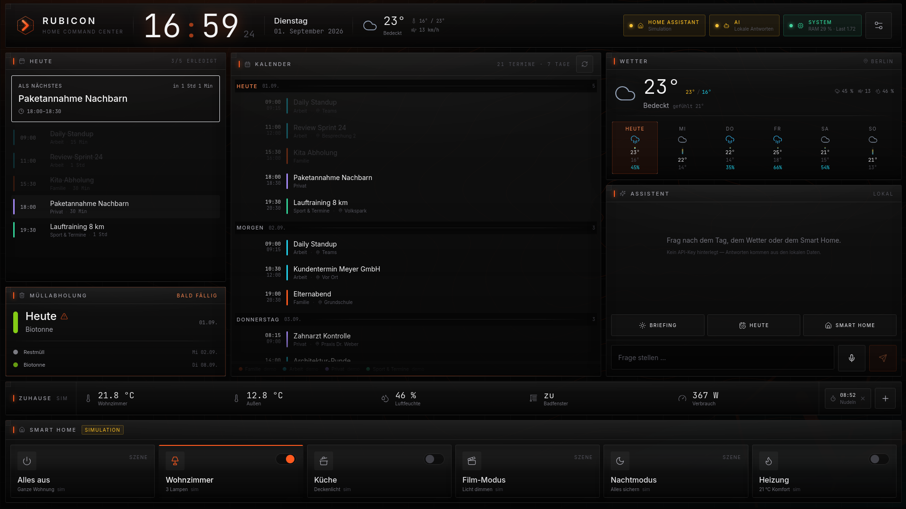

# CINDRALUX — Home Command Center

*[Deutsch](README.md) · [English](README.en.md)*

> 🚧 **In aktiver Entwicklung.** Läuft stabil im Alltag auf einem echten Pi,
> aber es kommen laufend neue Funktionen dazu und Struktur/API können sich
> noch ändern. Kein „fertiges" 1.0 in dem Sinne, dass nichts mehr passiert —
> siehe *Nächste Schritte* unten für den aktuellen Stand.

Lokales Touchscreen-Dashboard für einen Raspberry Pi im Chromium-Kiosk-Modus:
Kalender aus mehreren Quellen, Uhrzeit, Wetter, Müllabholung, Smart-Home-Schnellaktionen
und ein AI-Assistent — alles auf einem Bildschirm, ohne Cloud-Zwang.



---

## Warum Cindralux?

Familien-Kalender-Hubs und Smart Displays mit diesem Funktionsumfang werden
normalerweise als Hardware-plus-Abo verkauft: einmal für den Bildschirm
zahlen, danach dauerhaft weiterzahlen, damit der Kalender synchronisiert
bleibt oder die „Premium"-Kacheln freigeschaltet sind. Cindralux läuft auf
einem Raspberry Pi, den man ohnehin hat (oder für 40–80 € kauft), ist
kostenlos und quelloffen, und jede Anbindung ist opt-in — nichts telefoniert
nach Hause, außer man verbindet es selbst.

**Eine kostenlose, selbst gehostete Alternative zu bezahlten Hubs wie:**

- **Skylight Calendar** — ein Familienkalender-Tablet ab rund 130 €, mit
  optionalem Monatsabo für zusätzliche Funktionen.
- **Hearth Display** — ein Wand-Familienhub, der im laufenden Abo verkauft
  wird.
- **Google Nest Hub Max / Amazon Echo Show** — leistungsfähige Smart
  Displays, aber um die Cloud des jeweiligen Herstellers gebaut, mit
  manchen Funktionen hinter eigenen Abos (Nest Aware, Alexa+).

**Was direkt beim ersten Start mitkommt, ganz ohne Einrichtung oder Konto:**
ein realistischer Demo-Kalender, ein Wetter-Fallback-Datensatz, fünf
Platzhalter-Fotos für die Diashow, zehn Layout-Vorlagen fürs Dashboard und
fünf Farb-und-Schrift-Design-Vorlagen, ein vollständig lokales
Einkaufslisten-/Notizen-Panel und ein per WebAudio erzeugter Timer/Wecker,
der keine Audiodatei braucht.

**Wohin sich das entwickelt:** ÖPNV-Abfahrten und Fahrzeit zur Arbeit, sowie
ein Weckwort statt Knopfdruck für den Sprachmodus. Der Stand dazu steht
unten unter *Nächste Schritte* — Issues und Pull Requests sind willkommen.

---

## Schnellstart

```bash
npm install          # installiert Client und Server (npm workspaces)
npm run dev          # startet beides: Frontend :5173, Backend :4000
```

> Der Block `allowScripts` in der `package.json` gibt esbuild sein
> Installationsskript frei. npm ab Version 12 blockiert solche Skripte sonst,
> und ohne esbuild starten weder Vite noch tsx.

Dann `http://localhost:5173` öffnen. Das Dashboard ist sofort mit realistischen
Demodaten gefüllt — es muss nichts konfiguriert werden.

### Einzeln starten

```bash
npm run dev:client   # nur Vite-Dev-Server (:5173, proxyt /api auf :4000)
npm run dev:server   # nur Express-API (:4000)
```

### Produktionsnah (ein einziger Prozess)

```bash
npm run build        # baut das Frontend nach client/dist
npm start            # Express liefert API und Frontend unter :4000 aus
```

Diese Variante ist für den Pi gedacht: ein Prozess, eine Portnummer.

### Prüfen

```bash
npm run typecheck    # TypeScript für Client und Server
```

---

## Projektstruktur

```
client/     React 18 + Vite + TypeScript + Tailwind
  src/components/    Dashboard-Panels
  src/theme/tokens.js  ← zentrale Theme-Datei (Farben, Schatten, Akzente)
server/     Express + TypeScript (läuft über tsx, kein Build-Schritt nötig)
  src/services/      Kalender, Wetter, Müll, Home Assistant, AI
  src/routes/api.ts  alle Endpunkte
shared/     types.ts — gemeinsames Datenmodell, reine Typen
data/       config.json (Laufzeit), seeds/ (Demodaten), cache/
assets/     cindralux/ — Logo, Wasserzeichen, Hintergründe
```

`shared/types.ts` enthält bewusst **nur Typen**. Dadurch werden alle
`import type`-Verweise beim Transpilieren entfernt und weder Vite noch tsx
müssen `/shared` auflösen oder bündeln.

---

## Konfiguration

Alles ist über das **Einstellungs-Panel** (Zahnrad oben rechts) einstellbar.
Gespeichert wird nach `data/config.json` — die Datei ist gitignored, weil sie
Tokens enthält. Sie wird beim ersten Start automatisch mit Standardwerten angelegt.

Alternativ per Umgebungsvariable (gewinnt gegen die Datei — praktisch für eine
systemd-Unit auf dem Pi, ohne Secrets in der JSON abzulegen):

| Variable | Bedeutung |
| --- | --- |
| `HA_BASE_URL` / `HA_TOKEN` | Home Assistant |
| `AI_BASE_URL` / `AI_API_KEY` / `AI_MODEL` | AI-Assistent |
| `PORT` | API-Port (Standard 4000) |
| `HOST` | Bind-Adresse (Standard 127.0.0.1; Netzwerkzugriff siehe [Zugriff und Betrieb](docs/security.md)) |

Secrets werden nie an den Client ausgeliefert — die API meldet nur `hasToken`
bzw. `hasApiKey`. Ein leeres Feld beim Speichern lässt einen bestehenden Wert
unverändert; zum Löschen sendet das Panel den Sentinel `__clear__`.

---

## Integrationen: was ist echt, was ist Mock?

| Bereich | Status | Hinweis |
| --- | --- | --- |
| **Wetter** | **echt** | Open-Meteo, kein API-Key nötig — inkl. Stundenverlauf, Sonnenzeiten, Wind, Druck und UV. Fällt bei fehlendem Internet auf `data/seeds/weather.json` zurück, auch für das Detailfenster. |
| **Müllabholung** | **echt** | Wahlweise eigene Regeln (Wochentag + Rhythmus + Ankerdatum) oder der ICS-Kalender des Entsorgers, per Adresse oder Datei. |
| **Kalender** | **echt, sobald eine URL hinterlegt ist** | ICS/iCal inkl. Serienterminen, mit geführtem Dialog für Google-Kalender und Gruppierung nach Konto. Ohne URL liefert die Quelle Demodaten aus `data/seeds/calendar.json`. |
| **Home Assistant** | **vorbereitet, standardmäßig Mock** | Ohne URL + Token schaltet das Dashboard simulierte Zustände. Mit Konfiguration gehen dieselben Aufrufe an die echte REST-API. |
| **AI-Assistent** | **vorbereitet, standardmäßig lokal** | Ohne API-Key beantwortet der Server Fragen aus Kalender, Wetter und Müllplan — keine Platzhaltertexte, echte Daten. Mit Key geht es an eine OpenAI-kompatible API. |
| **Sprachmodus** | **vorbereitet, braucht OpenAI-Key** | Gespräch per Mikrofon über die Realtime API (WebRTC). Nur bei OpenAI verfügbar. |
| **Messwerte** | **echt, sobald HA verbunden ist** | Temperatur, Luftfeuchte, Fenster, Verbrauch. Ohne HA plausible Beispielwerte, die dem Tagesgang folgen. |
| **Timer & Wecker** | **echt** | Vollständig lokal, unabhängig von HA und AI. |
| **Fotos (Diashow)** | **echt** | Lokaler Bilderordner immer verfügbar; Google Fotos optional über den Picker (Auswahl in Googles eigenem Fenster). |

### Was du wofür extern einrichten musst — Überblick

Nichts davon ist Pflicht: Ohne jede Einrichtung läuft das Dashboard sofort mit
Wetter, Müllabholung nach eigenen Regeln, Demo-Kalender und lokalen Fotos.
Jede Zeile unten ist ein **optionaler** Ausbauschritt.

| Funktion | Was extern nötig ist | Aufwand |
| --- | --- | --- |
| **Wetter** | nichts — Open-Meteo ohne Schlüssel | keiner |
| **Müllabholung** | nichts (eigene Regeln) *oder* die ICS-Adresse/Datei deines Entsorgers | Adresse kopieren |
| **Kalender per iCal** | die private iCal-Adresse aus Google/Nextcloud/iCloud/Outlook | Adresse kopieren |
| **Kalender per Google-API** (empfohlen, fast live) | ein eigenes Google-Cloud-Projekt + OAuth-Client | ~10 Min, einmalig — [docs/google-kalender.md](docs/google-kalender.md) |
| **Google Fotos in der Diashow** | dasselbe Google-Cloud-Projekt, zusätzlich Photos Picker API aktiviert | ~2 Min, einmalig — [docs/google-fotos.md](docs/google-fotos.md) |
| **Home Assistant** | ein Long-Lived Access Token aus deiner eigenen HA-Instanz | ~1 Min |
| **AI-Assistent (Text/Briefing)** | optional ein API-Key bei OpenAI oder einer OpenAI-kompatiblen API (LM Studio/Ollama laufen ganz ohne Internet) | wenige Minuten |
| **Sprachmodus (Mikrofon)** | ein OpenAI-API-Key **mit Guthaben** — ein ChatGPT-Plus-Abo reicht dafür nicht | siehe unten |
| **GPT Live** | nichts zwingend (öffnet chatgpt.com im Browser); optional ein Gerätebefehl für den Kiosk-Betrieb | keiner bis wenige Minuten |
| **Spenden-Button** | nichts — reiner Link | keiner |

Alle Zugangsdaten bleiben ausschließlich lokal in `data/config.json` auf
diesem Gerät und werden nie an den Browser ausgeliefert.

### Kalender anbinden

#### Google-Kalender über die API (empfohlen)

Unter *Einstellungen → Kalender → Google Kalender* ein Google-Konto verbinden.
Danach erscheinen alle Kalender des Kontos zur Auswahl; ein Tipp nimmt einen
davon ins Dashboard auf.

Vorteile gegenüber der iCal-Adresse: **nahezu live** statt bis zu 24 Stunden
Verzögerung, alle Kalender eines Kontos auf einen Blick, und Google löst
Serientermine mit `singleEvents=true` selbst auf — die gesamte RRULE-Behandlung
entfällt.

Preis dafür ist ein einmaliges Google-Cloud-Projekt (rund zehn Minuten).
Schritt für Schritt: **[docs/google-kalender.md](docs/google-kalender.md)**.

Angefordert wird ausschließlich `calendar.readonly` — das Dashboard kann Termine
lesen, nicht ändern. Client-Secret und Refresh-Token bleiben lokal in
`data/config.json` und werden nie an den Client ausgeliefert.

#### Google-Kalender über die private iCal-Adresse (ohne Google-Projekt)

**So findest du den Link:**

> Google Kalender → den Kalender in der linken Liste auswählen →
> **Einstellungen und Freigabe** → ganz nach unten zu **Kalender integrieren** →
> Feld **Geheime Adresse im iCal-Format** kopieren.

Die Adresse endet auf `.ics`. Zwei Verwechslungen sind häufig — beide erkennt
das Dashboard und sagt dir konkret, was falsch ist:

- die Adresse der **Weboberfläche** (`…/calendar/u/0?cid=…`)
- die **Einbettungs-Adresse** (`…/calendar/embed?src=…`)

> ### Diese Adresse ist ein Geheimnis
>
> Wer sie hat, kann deinen kompletten Kalender lesen — ohne Login, ohne
> Einladung. Behandle sie wie ein Passwort:
>
> - **niemals committen**, weitergeben oder in ein Ticket schreiben
> - nicht in Screenshots oder Logs zeigen
> - bei Verdacht in Google auf **Zurücksetzen** klicken; die alte Adresse wird
>   damit sofort ungültig
>
> Das Dashboard hält sich daran: Die Adresse wird ausschließlich serverseitig
> benutzt und **verlässt den Server nie**. Der Browser erfährt nur, *dass* eine
> hinterlegt ist, plus einen ungefährlichen Hinweis wie
> `calendar.google.com/…/basic.ics`. Aus Fehlermeldungen und Logzeilen werden
> Adressen vor der Ausgabe entfernt, und der Kalendercache speichert statt der
> Adresse nur einen nicht umkehrbaren Kurz-Hash.

**Wo du sie einträgst** — zwei Wege, beide gleichwertig:

1. **Im Dashboard**: Zahnrad → *Kalender* → bei der Quelle die Adresse ins
   Feld einfügen → *Speichern*. Danach zeigt das Feld nur noch
   `•••••••••• (hinterlegt)`.
2. **In der Datei** `data/config.json`. Der Server bemerkt Änderungen an dieser
   Datei selbst und lädt sie neu — ein Neustart ist nicht nötig.

```json
{
  "calendars": [
    {
      "id": "google-private",
      "name": "Privat",
      "color": "#ff7a1a",
      "url": "YOUR_PRIVATE_ICS_URL",
      "enabled": true
    }
  ]
}
```

`data/config.json` ist in `.gitignore` und enthält deine echten Daten.
`data/config.example.json` liegt daneben, hat dieselbe Struktur und
ausschließlich Platzhalter — die Datei gehört ins Repo.

**Phase 1 nutzt ICS.** Das genügt für ein Dashboard und braucht kein
Google-Projekt. Der Preis ist die Aktualität: Google schreibt neue Termine oft
erst nach Stunden in den Feed. Wer das nicht will, nimmt den OAuth-Weg oben —
er ist bereits eingebaut und lässt sich jederzeit nachrüsten, ohne dass die
ICS-Quellen verschwinden. Beide Wege laufen nebeneinander.

#### Weitere ICS-Quellen

In den Einstellungen unter *Kalender* auf **Google-Kalender** tippen. Der Dialog
führt durch den Klickpfad in Google und prüft die Adresse, bevor er sie
übernimmt: Er ruft den Feed einmal ab, bestätigt dass Termine ankommen und
übernimmt den Kalendernamen direkt aus der Datei.

Kalender werden nach **Konto** gruppiert — mehrere Google-Konten (privat,
beruflich) lassen sich nebeneinander führen. Das Kontofeld ist ein freier Text
und dient nur der Gruppierung.

Häufige Fehleingaben erkennt die Prüfung und benennt sie konkret: die
Einbettungs-Adresse, die Adresse der Weboberfläche und die öffentliche statt der
privaten Adresse führen jeweils zu einem eigenen Hinweis statt zu einem
allgemeinen Fehler.

> **Zwei Dinge, die man wissen sollte.**
> Die Privatadresse wirkt wie ein Passwort — wer sie kennt, kann den Kalender
> lesen. Sie bleibt lokal in `data/config.json` und lässt sich in Google
> jederzeit zurücksetzen.
> Google aktualisiert iCal-Feeds außerdem nur träge: neue oder verschobene
> Termine können bis zu 24 Stunden brauchen. Das ist eine Grenze von Google und
> lässt sich vom Aktualisierungsintervall des Dashboards nicht beeinflussen. Wer
> nahezu Live-Daten braucht, kommt an Google OAuth nicht vorbei — das wäre ein
> eigener Ausbauschritt.

#### Andere Quellen

**Andere ICS-URL** nimmt jede beliebige iCal-Adresse — Nextcloud, iCloud,
Outlook, Vereins- oder Feiertagskalender. `webcal://` wird automatisch auf
`https://` umgeschrieben.

Der Kalenderdienst führt alle aktiven Quellen zusammen, löst Serientermine
(`RRULE`) samt Ausnahmen (`EXDATE`) und Einzeländerungen (`RECURRENCE-ID`) auf
und korrigiert die Sommerzeit-Verschiebung, die bei der Expansion von
Wiederholungen sonst entsteht. Der Cache liegt in `data/cache/calendar.json`.

### Home Assistant anbinden

1. In Home Assistant: Profil → Sicherheit → **Long-Lived Access Token** erzeugen.
2. In den Einstellungen unter *Verbindungen* Basis-URL und Token eintragen.
3. Auf *Home Assistant testen* tippen.

Die Kacheln unter *Darstellung* verweisen auf `entity_id`s. Eine Toggle-Kachel
ruft `turn_on`/`turn_off` je nach aktuellem Zustand, eine Szenen-Kachel löst
einmalig aus.

### Kalenderansichten

Der Kalender kennt drei Ansichten, umschaltbar in seiner Kopfzeile:

| Ansicht | Zweck |
| --- | --- |
| **Tag** | Zeitschiene mit festem Stundenraster (58 px je Stunde). Termine liegen maßstäblich, eine Ember-Linie markiert *jetzt*. Pfeiltasten blättern durch die Tage. |
| **Woche** | Die kompakte Liste der nächsten sieben Tage — gut zum Überfliegen. |
| **Monat** | Rasterkalender mit farbigen Terminpunkten je Tag. Ein Tipp auf einen Tag springt in die Tagesansicht. |

Unter *Einstellungen → Kalender → Ansicht* legst du fest, welche Ansicht die
**Standardansicht** ist und nach wie vielen Minuten ohne Bedienung der Kalender
dorthin **zurückspringt** (Standard 5 Minuten, 0 schaltet es ab). Jede Bedienung
setzt die Frist neu — ein Panel im Flur soll nicht auf der Ansicht stehen
bleiben, die jemand vor Stunden geöffnet hat.

Die Tagesansicht nutzt bewusst eine **Pixel-Skala statt Prozent**: bei
prozentualer Höhe schrumpft ein 15-Minuten-Termin auf wenige Pixel und sein
Titel wird abgeschnitten. Mit fester Skala scrollt der Tag stattdessen.

### Abfuhrkalender des Entsorgers

Unter *Einstellungen → Müll & Wetter → Abfuhrkalender* lässt sich zwischen
**eigenen Regeln** und dem **Kalender des Entsorgers** umschalten.

Für den ICS-Weg entweder eine Adresse eintragen oder eine `.ics`-Datei hochladen
(für Entsorger, die nur einen Download anbieten). Ist eine Adresse gesetzt, hat
sie Vorrang. Der *Prüfen*-Knopf holt den Kalender und meldet, wie viele Termine
und welche Tonnenarten gefunden wurden.

Die Tonnenart wird aus der **Terminbezeichnung** erkannt — Entsorger benennen
sie sehr unterschiedlich („Restmuell 2-woechentlich", „Restabfall", „Graue
Tonne"). Deshalb wird auf Stichworte geprüft und vorher werden Umlaute
normalisiert. Erkannt werden Restmüll, Bio, Papier, Gelber Sack, Glas und
Sperrmüll; alles andere behält seine Originalbezeichnung.

Die Adresse wird höchstens alle sechs Stunden neu abgerufen — Abfuhrkalender
ändern sich selten.

### Standort wählen

Unter *Einstellungen → Müll & Wetter → Wetter-Standort*:

- **Ortssuche** über die Open-Meteo-Geocoding-API (kein Schlüssel nötig).
  Ortsnamen eingeben, aus der Trefferliste wählen — Koordinaten und Zeitzone
  werden übernommen.
- **„Hier"** fragt den Standort beim Browser ab und übersetzt ihn in einen
  Ortsnamen. Funktioniert nur im sicheren Kontext (`localhost` oder HTTPS),
  genau wie das Mikrofon.
- Koordinaten und Zeitzone bleiben zusätzlich von Hand korrigierbar.

### Wetter-Detailfenster

Ein Tipp auf die Wetterkarte fährt ein Detailfenster mittig ein — mit allem, was
auf der Karte keinen Platz hat:

- **Tagesverlauf über 24 Stunden.** Temperatur als Linie, Regenwahrscheinlichkeit
  als Balken darunter. Bewusst **zwei übereinanderliegende Diagramme mit
  gemeinsamer Zeitachse** statt einer zweiten y-Achse: zwei Größen mit
  verschiedener Skala in einem Koordinatensystem sind praktisch immer
  irreführend. Über das Diagramm streichen zeigt die Stundenwerte.
- Sonnenauf- und -untergang
- Wind mit Richtung und Böen, Luftfeuchte, Luftdruck, Bewölkung, UV-Index
  (mit WHO-Stufe) und Niederschlagsmenge
- Volle Wochenvorschau mit Temperaturspannen auf gemeinsamer Skala

Die Diagrammfarben (Bernstein `#d97706`, Blau `#0284c7`) sind gegen die dunkle
Fläche geprüft: Sie liegen im Helligkeitsband für dunkle Oberflächen und trennen
sich auch bei Rot-Grün- und Blau-Gelb-Schwäche deutlich (ΔE > 23). Beide Reihen
sind zusätzlich beschriftet — die Farbe allein trägt nie die Bedeutung. Dieselben
Werte stehen für Screenreader als Tabelle im Markup.

### Anordnung des Dashboards

Unter *Einstellungen → Darstellung → Anordnung* legst du fest, welche Panels
das Raster zeigt und wo sie stehen. Zehn Vorlagen decken die üblichen Fälle ab
— jede mit einer kleinen Vorschau der Spaltenaufteilung:

| Vorlage | Wofür |
| --- | --- |
| **Standard** | Tagesplan und Müll links, Kalender mittig, Wetter rechts |
| **Kalender groß** | Wandkalender: der Monat bekommt neun von zwölf Spalten |
| **Zwei Spalten** | Nur Tagesplan und Kalender, ruhigste Variante |
| **Tagesplan** | Was heute ansteht, groß; Kalender und Wetter als Beiwerk |
| **Wetterstation** | Wetter vorn, dazu Messwerte aus dem Haus |
| **Smart Home** | Schnellaktionen und Messwerte dauerhaft statt im Fenster |
| **Küche** | Einkaufsliste offen, daneben Termine und Wetter |
| **Nur Kalender** | Volle Breite für Termine, alles andere in der Startleiste |
| **Alles auf einen Blick** | Vier schmale Spalten, dicht, nichts muss angetippt werden |
| **Assistent** | Der AI-Assistent steht fest rechts |

Reine Spiegelungen derselben Aufteilung sind bewusst nicht dabei — „Wetter mal
links, mal rechts" ist keine eigene Anordnung, sondern Geschmack.

**Eigene Anordnung.** Wer es genauer will, wählt *Eigene* und stellt selbst
zusammen: ein bis vier Spalten, deren Breiten und für jedes der acht Panels,
in welcher Spalte es steht (oder ob es aus dem Raster verschwindet). Ziehen und
Ablegen gibt es bewusst nicht — auf einem Touchpanel im Flur ist das mit
fettigen Fingern eine Zumutung; stattdessen genügen Einzeltipps.

Die Spaltensumme bleibt dabei immer zwölf: Wird eine Spalte breiter, gibt die
breiteste andere ab. Ein ungültiges Raster kann so gar nicht erst entstehen.
Abgewählte Panels sind nicht verloren — Smart Home, Messwerte, Assistent und
Liste öffnen sich weiterhin über die Startleiste.

### Startleiste: Smart Home, Zuhause, Assistent

Diese drei belegen keinen Platz mehr dauerhaft, sondern öffnen sich auf Tipp als
Fenster über der **Startleiste** am unteren Rand. Dadurch bleibt oben deutlich
mehr Raum für Kalender und Tagesübersicht — die Dinge, die man im Vorbeigehen
liest, ohne etwas anzutippen.

Die Knöpfe zeigen den Zustand mit: wie viele Geräte an sind, wie viele Messwerte
auffällig sind, ob ein AI-Zugang hinterlegt ist. Rechts daneben laufen die
Timer-Chips und der Knopf zum Timerstellen.

Alle Fenster liegen in einem **Portal an `<body>`**: `position: fixed` bezieht
sich sonst nicht auf das Fenster, sobald ein Vorfahre eine `transform` trägt —
und genau das macht der Einbrennschutz mit der gesamten Oberfläche.

### Messwerte aufs Dashboard

Unter *Einstellungen → Zuhause* lassen sich beliebig viele Werte einrichten, die
als **Zuhause-Leiste** über den Schnellaktionen erscheinen: Temperaturen,
Luftfeuchte, Fensterkontakte, Stromverbrauch, PV-Ertrag, Anwesenheit.

Die `entity_id` wird **ausgewählt, nicht getippt**: Ist Home Assistant
verbunden, holt die App die echte Entity-Liste samt aktueller Werte und bietet
sie durchsuchbar an. Ohne Verbindung erscheint eine Beispielauswahl, sodass
sich alles vorab einrichten lässt.

Binäre Zustände werden lesbar gemacht — aus `on` wird je nach Geräteklasse
„offen", „läuft" oder „zuhause". Ein Wert in Alarmzustand (offenes Fenster)
bekommt eine Ember-Kante und fällt aus der Entfernung sofort auf.

Standardmäßig sind fünf Werte aktiv; mehr passen bei 1024 × 600 nicht mehr
lesbar nebeneinander. Weitere sind vorbereitet und lassen sich zuschalten.

### Timer & Wecker

Vollständig lokal, ohne Home Assistant und ohne AI.

- **Per Touch:** das **+** rechts in der Zuhause-Leiste. Timer über Voreinstellungen
  von 3 bis 60 Minuten, Wecker mit Uhrzeit und Wochentagen.
- **Per Sprache:** „stell einen Timer auf zehn Minuten", „weck mich werktags um
  Viertel vor sieben", „welche Timer laufen?", „lösch den Timer Nudeln".
  Der Sprachassistent bekommt dafür vier Funktionen, die er selbst aufrufen kann.
- Laufende Timer zählen als Chips in der Zuhause-Leiste herunter, in der letzten
  Minute in Ember. Ein abgelaufener meldet sich im **Vollbild** mit Ton — ein
  Küchentimer muss quer durch den Raum wahrnehmbar sein.

Der Klingelton wird per WebAudio erzeugt, es gibt also keine Audiodatei zu laden.
Browser erlauben Ton erst nach einer Nutzerinteraktion; die erste Berührung des
Panels schaltet ihn frei.

**Gestellte Wecker überleben einen Neustart** (`data/timers.json`), kurze Timer
bewusst nicht — sie wären nach einem Neustart ohnehin abgelaufen.

### Fotos für die Diashow

Der Ruhemodus (siehe *Nachtabsenkung und Einbrennschutz*) kann zwischen Uhr und
Tagesübersicht eine Bilder-Diashow zeigen. Unter *Einstellungen → Ruhemodus →
Bilder* gibt es zwei Quellen, die sich mischen lassen:

- **Lokaler Ordner** (`data/photos/` per Default, änderbar). Bilder einfach
  hineinkopieren — jpg, png, webp, avif, gif und svg werden erkannt. Läuft
  ohne Internet und ohne Konto, das ist die verlässliche Grundlage.
- **Google Fotos** über die **Picker API**. Ein Tipp auf *Google Fotos
  auswählen* öffnet Googles eigenes Auswahlfenster; was dort ausgewählt und
  bestätigt wird, lädt das Dashboard herunter und legt es als normale Datei in
  denselben Ordner. Danach unterscheidet sich ein Google-Bild aus Sicht der
  Diashow nicht mehr von einem lokalen — inklusive der Möglichkeit, es einzeln
  ab- oder wieder anzuwählen.

  Google hat 2025 den automatischen Zugriff auf die ganze Mediathek
  abgeschafft; der Picker ist der verbleibende Weg und verlangt bei jedem
  Import eine bewusste Auswahl im eigenen Fenster — kein Hintergrund-Sync
  eines Albums. Die Verbindung ist dieselbe wie beim Google-Kalender (ein
  Google-Konto, ein OAuth-Client); Einrichtung:
  **[docs/google-fotos.md](docs/google-fotos.md)**.

In beiden Fällen entscheidet die Kachel-Auswahl in den Einstellungen, welche
Bilder die Diashow tatsächlich zeigt — ohne jede Auswahl laufen alle.

**Bildausschnitt.** Ein Foto füllt den Bildschirm per `object-fit: cover` —
ohne weitere Angabe also mittig zugeschnitten. Bei „Ausschnitt wählen" an
jeder Kachel lässt sich ein heller Rahmen im tatsächlichen Seitenverhältnis
des gerade genutzten Bildschirms über das Bild ziehen; die Diashow zeigt
danach genau das, was im Rahmen lag. Ohne eigene Wahl bleibt es bei der
Bildmitte.

**Ken Burns.** Der Übergang „Ken Burns" fährt nicht immer in dieselbe
Richtung: neun Varianten (acht Richtungen hinein — auch diagonal — plus
eine hinaus) wechseln bei jedem Bildwechsel zufällig durch.

### Einkaufsliste & Notizen

Über den **„Liste"-Knopf** in der Startleiste öffnet sich ein Fenster mit zwei
Reitern: Einkaufsliste und Notizen. Beide vollständig lokal
(`data/lists.json`), ohne Home Assistant oder AI. Die Einkaufsliste hakt
Einträge ab statt sie sofort zu löschen — erst der eigene
„Erledigte löschen"-Knopf räumt auf, damit ein versehentliches Antippen nichts
verschwinden lässt.

### Alexa

**Bewusst nicht direkt integriert.** Dieses Dashboard spricht ausschließlich mit
Home Assistant. Der Weg zu Alexa führt später über Home Assistant — Alexa Smart
Home Skill, HA-Automationen, Node-RED oder Webhooks. Damit bleibt genau eine
Integrationsstelle statt zweier paralleler Wege.

### AI-Assistent

Funktioniert mit jedem Server, der `POST /chat/completions` im OpenAI-Format
versteht:

| Anbieter | Basis-URL |
| --- | --- |
| OpenAI | `https://api.openai.com/v1` |
| LM Studio | `http://localhost:1234/v1` |
| Ollama | `http://localhost:11434/v1` |

Kalender, Wetter und Müllabholung werden als Kontext mitgeschickt, damit das
Tagesbriefing die echte Lage beschreibt.

### Zwei Modi im AI-Bereich

Der Assistent hat oben einen Umschalter:

**1. Cindralux Assistant** — das eigene Panel: Textfeld, Tagesbriefing, „Was steht
heute an?", Smart-Home-Vorschlag, Timer per Sprache und der Mikrofon-Knopf für
den Sprachmodus. Nutzt eine OpenAI-kompatible API oder antwortet aus den lokalen
Daten, wenn kein Key hinterlegt ist.

**2. GPT Live** — ein großer Knopf, der chatgpt.com in einem **eigenen Fenster**
öffnet.

> **Warum nicht eingebettet?** chatgpt.com setzt `frame-ancestors`
> beziehungsweise `X-Frame-Options`; ein iframe wird vom Browser blockiert. Es
> gibt dafür keinen zulässigen Umweg, und inoffizielle Login-Hacks kämen nicht
> in Frage. Ein eigenes Fenster ist der ehrliche Weg.

Unter *Einstellungen → Verbindungen → GPT Live* stellst du ein, **wie** geöffnet
wird:

| Modus | Verhalten |
| --- | --- |
| **Browserfenster** (Standard) | `window.open` aus der Seite heraus. Funktioniert ohne Einrichtung. Wird das Fenster von einem Popup-Blocker verschluckt, sagt die Oberfläche das. |
| **Befehl auf dem Gerät** | Der Server startet einen konfigurierten Befehl, z. B. `brave --app=https://chatgpt.com`. Im Kiosk-Betrieb der zuverlässigere Weg, weil ein Popup dort sonst im selben Vollbildfenster landet. |

Zur Sicherheit: Der Befehl stammt **ausschließlich aus `data/config.json`**, nie
aus der Anfrage — der Client löst nur aus. Gestartet wird ohne Shell, damit auch
eine seltsame URL in der Konfiguration keine Befehlskette auslösen kann.

### Sprachmodus (Mikrofon)

Der Mikrofon-Knopf im Assistenz-Panel startet ein echtes Gespräch über die
**OpenAI Realtime API** — Sprache rein, Sprache raus, ohne Umweg über Text.

> **Ein ChatGPT-Plus- oder Pro-Abo schaltet die API nicht frei.** Abo und API
> sind bei OpenAI getrennte Produkte. Für den Sprachmodus brauchst du einen
> API-Key von [platform.openai.com](https://platform.openai.com) mit Guthaben.
> Realtime-Audio kostet je nach Modell grob 0,50–1 € pro Gesprächsstunde.

**So läuft es ab:** Der Server stellt ein kurzlebiges Client-Token aus (wenige
Minuten gültig), der Browser baut damit selbst eine WebRTC-Verbindung zu OpenAI
auf. Der eigentliche API-Key verlässt den Pi nie. Ein Server-Relay wäre die
Alternative, würde den Audiostrom aber ohne Sicherheitsgewinn durch den Pi
schleifen und Latenz kosten — bei einem Sprachdialog der entscheidende Nachteil.

Der Assistent bekommt dieselben Haushaltsdaten als Kontext wie der Textchat,
aber eine eigene Stilanweisung: kurze gesprochene Sätze, keine Aufzählungen,
Uhrzeiten natürlich ausgesprochen.

Zusätzlich zu den Timer- und Wecker-Funktionen steuert er die in `smartHomeActions`
konfigurierten Geräte — „mach das Wohnzimmerlicht aus", „Film-Modus an". Welche Namen
existieren, steht direkt in der Beschreibung des Werkzeugs; das Modell darf nur auswählen,
was konfiguriert ist. Ohne konfigurierte Aktionen bleibt der Sprachmodus bei Timer und Wecker.

Einstellbar unter *Verbindungen → Sprachmodus*: Modell, Stimme (10 Stimmen zur
Auswahl) und das Transkriptionsmodell für den mitlaufenden Gesprächsverlauf.

**Mikrofon braucht einen sicheren Kontext.** `http://localhost` gilt als sicher,
eine LAN-Adresse wie `http://192.168.1.50:4000` **nicht** — dort blockiert der
Browser `getUserMedia`. Für den Zugriff vom Handy also entweder HTTPS einrichten
oder Chromium mit
`--unsafely-treat-insecure-origin-as-secure=http://192.168.1.50:4000` starten.

Im Kiosk-Modus verhindert `--use-fake-ui-for-media-stream`, dass Chromium bei
jedem Start nach der Mikrofonerlaubnis fragt.

Die Endpunkte der Realtime-API stehen bewusst in der Konfiguration: OpenAI hat
sie von Beta auf GA umgestellt, und der Code versucht beide Varianten. So lässt
sich eine künftige Änderung ohne Codeänderung nachziehen.

---

## API

| Methode | Pfad | Zweck |
| --- | --- | --- |
| GET | `/api/health` | Status inkl. Platzhalter für Pi-Systemwerte |
| GET / PUT | `/api/config` | Konfiguration lesen / schreiben (Secrets maskiert) |
| GET | `/api/calendar/events` | Zusammengeführte Termine (`?force=1` erzwingt Neuabruf) |
| GET | `/api/google/status` | Verbindungsstand des Google-Kontos |
| GET | `/api/google/auth-url` | Adresse des Zustimmungsdialogs |
| GET | `/api/google/callback` | Weiterleitungsziel des OAuth-Ablaufs |
| GET | `/api/google/calendars` | Kalenderliste des verbundenen Kontos |
| POST | `/api/google/disconnect` | Verbindung trennen |
| GET | `/api/photos` | Alle Bilder des Ordners samt Auswahlzustand |
| GET | `/api/photos/active` | Nur die für die Diashow ausgewählten Bilder |
| GET | `/api/photos/file/:name` | Ein Bild ausliefern |
| POST | `/api/google/photos/session` | Google-Photos-Picker-Sitzung anlegen |
| GET | `/api/google/photos/session/:id` | Nachfragen, ob die Auswahl im Picker-Fenster steht |
| POST | `/api/google/photos/session/:id/import` | Ausgewählte Bilder herunterladen und in die lokale Bibliothek übernehmen |
| DELETE | `/api/google/photos/session/:id` | Picker-Sitzung abbrechen / aufräumen |
| POST | `/api/calendar/refresh` | Alle Quellen sofort neu laden |
| POST | `/api/calendar/validate` | ICS-Adresse prüfen, Name und Terminzahl auslesen |
| GET | `/api/trash/next` | Nächste Abholung + kommende Termine |
| POST | `/api/trash/validate` | ICS-Abfuhrkalender prüfen |
| GET | `/api/geo/search` | Ortssuche für den Wetter-Standort |
| GET | `/api/geo/reverse` | Koordinaten in einen Ortsnamen übersetzen |
| GET | `/api/weather` | Aktuelles Wetter + 7-Tage-Vorschau |
| GET | `/api/home-assistant/status` | Verbindungs- und Entity-Zustände |
| GET | `/api/home-assistant/entities` | Entity-Liste für die Auswahl in den Einstellungen |
| GET | `/api/home-assistant/sensors` | Aufbereitete Messwerte fürs Dashboard |
| POST | `/api/home-assistant/call-service` | Service-Call (`domain`, `service`, `entityId`, `serviceData`) |
| POST | `/api/ai/chat` | Freie Frage an den Assistenten |
| POST | `/api/ai/daily-briefing` | Tagesbriefing aus Kalender, Wetter, Müll |
| POST | `/api/ai/realtime/session` | Kurzlebiges Token für den Sprachmodus (inkl. Werkzeuge) |
| POST | `/api/ai/gpt-live/open` | Öffnet ChatGPT im Browser oder per Gerätebefehl |
| GET / POST | `/api/timers` | Timer und Wecker lesen / anlegen |
| POST | `/api/timers/:id/dismiss` | Klingeln bestätigen (Wecker rücken weiter) |
| DELETE | `/api/timers/:id` | Timer oder Wecker löschen |
| POST | `/api/test/{home-assistant,ai,realtime,calendar,weather}` | Verbindungstests für das Einstellungs-Panel |

---

## Design

Die Oberfläche ist als Kontrollraum-Instrument gedacht, nicht als Karten-Dashboard:
Hairline-Ränder, Innenschatten, Ember-Eckwinkel, feine Scanlines und prozedurale
Körnung. Zahlen laufen durchgehend tabellarisch, damit die Uhr nicht zappelt.

**Zentrale Theme-Datei:** `client/src/theme/tokens.js`. Sie wird sowohl von
`tailwind.config.js` als auch vom TypeScript-Code gelesen — Farben, Schatten,
Kalenderpalette und Hintergrundliste stehen genau einmal.

Der Akzent liegt zur Laufzeit in der CSS-Variablen `--accent`, deshalb wirkt ein
Wechsel des Theme-Modus sofort ohne Neubau.

### Farben & Schrift

Unter *Einstellungen → Darstellung → Farben & Schrift*:

- **Acht Akzentfarben** (Ember, Crimson, Graphit, Mint, Violett, Amber, Azurit,
  Rose) plus **eigene Farbe** per Farbwähler — die vier nötigen Abstufungen
  (hell/dunkel/kräftig) werden aus der einen Farbe per HSL berechnet.
- **Sechs Schriftarten** (Standard/Inter, Space Grotesk, Sora, Manrope, Public
  Sans, Outfit), unabhängig von der Farbe wählbar.
- **Fünf fertige Design-Vorlagen** kombinieren beides mit einem Tipp (z. B.
  Mint + Space Grotesk); Farbe und Schrift lassen sich danach trotzdem einzeln
  weiter anpassen.

Beides läuft über CSS-Variablen (`--font-sans`/`--font-mono` wie `--accent`) —
ein Wechsel greift sofort, ohne Neuladen.

### Nachtabsenkung und Einbrennschutz

Unter *Einstellungen → Darstellung*:

- **Nachtabsenkung** dunkelt das Panel in einem einstellbaren Zeitfenster ab
  (Standard 22–6 Uhr). Jede Berührung weckt es für eine einstellbare Dauer voll
  auf. Optional zeigt es nachts **nur die Uhr** — groß, stark gedimmt, mit Datum
  und einer anstehenden Müllabholung, damit man nachts nicht doch das Dashboard
  sucht.
- **Einbrennschutz** verschiebt die Oberfläche im Minutentakt um wenige Pixel
  entlang zweier Sinuskurven unterschiedlicher Periode. Ein statisches Dashboard
  brennt sich sonst in viele Displays ein.

> Die Absenkung dunkelt **das Bild** ab — die Hintergrundbeleuchtung lässt sich
> aus dem Browser nicht steuern. Für echtes Abschalten des Displays auf dem Pi:
> `xset dpms force off` per cron, oder auf neueren Systemen
> `wlr-randr --output HDMI-A-1 --off`. Das gehört ins Pi-Setup, nicht in die App.

### Touchscreen

- Alle Bedienflächen mindestens 46–64 px hoch
- Zustand wird über `:active` gezeigt, nicht über `:hover`
- Kein Text-Markieren beim Wischen, kein Gummiband-Scroll
- Das Dashboard scrollt nie als Ganzes — nur einzelne Panels intern
- Einstellungen als Vollbild-Overlay: keine Browser-Navigation nötig

### Auflösungen

Getestet im Querformat bei **1024×600**, **1280×800** und **1920×1080**.
Neben den Breiten-Breakpoints gibt es eine Höhen-Variante `short`
(`max-height: 720px`), die auf flachen Panels Polster, Kachelhöhen und
Schriftgrößen zurücknimmt. Bei 1024 × 600 passt nicht alles gleichzeitig —
dort greifen zwei bewusste Entscheidungen:

- Die Wettervorschau wird zu **einer kompakten Zeile** statt eines
  Temperaturbalken-Diagramms.
- Der Assistent verliert das **Textfeld** und behält Sprache plus
  Schnellaktionen. Auf einem 1024 × 600-Touchpanel verdeckt die
  Bildschirmtastatur ohnehin das halbe Dashboard.

### Eigene Cindralux-Assets

Dateien in `assets/cindralux/` ersetzen — Namen beibehalten, dann ändert sich im
Code nichts. Details und Maße stehen in `assets/cindralux/README.md`.

### Kiosk verlassen

Unter *Einstellungen → System → Kiosk beenden* schließt Chromium und legt eine
Sentinel-Datei an (`data/.exit-kiosk`); das Kiosk-Skript sieht sie beim
nächsten Schleifendurchlauf und startet Chromium **nicht** automatisch neu —
man landet auf dem bloßen Desktop. Kein `sudo` nötig, weil nichts Systemweites
angefasst wird. Zurück zum Kiosk: das Skript erneut ausführen oder den Pi neu
starten.

### Rechtliches & Unterstützung

Unten in der Einstellungs-Seitenleiste stehen Datenschutzerklärung und
Haftungsausschluss (öffnen als eigenes Fenster) sowie ein kleiner
Spenden-Link. Alle drei sind reiner Text bzw. ein Link — keine Anbindung an
einen Dienst, kein Tracking.

---

## Auf dem Raspberry Pi

Schritt für Schritt: **[docs/raspberry-pi.md](docs/raspberry-pi.md)** — Node,
Dienst, Kiosk-Autostart, Mikrofon, Bildschirm nachts. Die fertigen Dateien
liegen in [`deploy/`](deploy/).

Kurzfassung: `npm install && npm run build`, dann läuft alles als **ein**
Prozess (`npm start`) auf Port 4000 — Frontend und API zusammen.

> `node_modules` nicht vom Rechner auf den Pi kopieren: Die enthaltenen
> Programmdateien sind für x86 gebaut. Auf dem Pi neu installieren.

## Nächste Schritte

Home-Assistant-Zustände laufen über WebSocket statt Polling
(`services/homeAssistantSocket.ts`) — eine dauerhafte Verbindung statt eines
REST-Requests je Kachel/Sensor bei jedem Client-Poll, REST bleibt Fallback,
solange die Verbindung noch nicht steht. Live gegen eine echte HA-Instanz
getestet.

Verschiebbarer Bildausschnitt pro Foto in der Diashow-Auswahl und ein
Ken-Burns-Effekt mit neun wechselnden Fahrtrichtungen statt einer festen sind
ebenfalls fertig (siehe *Fotos für die Diashow*).

Offen:

- ÖPNV-Abfahrten und Fahrzeit zur Arbeit.
- Weckwort statt Knopfdruck (z. B. openWakeWord lokal auf dem Pi) — braucht
  zuerst ein Mikrofon am Pi, das noch nicht geklärt ist.
